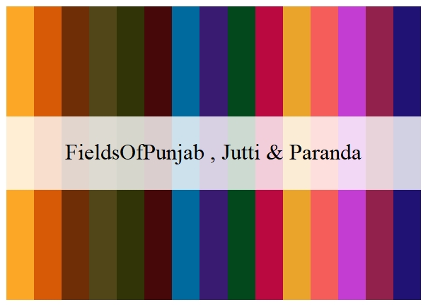
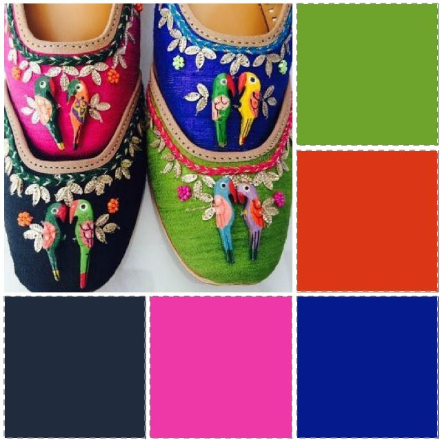

```{r setup, include = FALSE}
knitr::opts_chunk$set(
  collapse = TRUE,
  comment = "#>"
)
```


R code that defines color palettes based on the unique, vibrant culture of Punjab, India.

Rangla Punjab translates to "Colorful Punjab".

And if you ever visit India, [Rangla Punjab](https://haveli.co/rangla-punjab/) is a wonderful Punjabi theme village of generations gone by.

In the meantime, enjoy this R package :-)


## Functions

<li><a href="#listpalette">List Palette: <code>ListPalette()</code></a></li>
<li><a href="#ranglapunjab">Rangla Punjab: <code>RanglaPunjab(name)</code></a></li>
<li><a href="#mergepalette">Merge Palette: <code>MergePalette(name, name2, name3)</code></a></li>
<li><a href="#paintpalette">Paint Palette: <code>PaintPalette(name, name2, name3)</code></a></li>
<li><a href="#cherrypickpalette">Cherry Pick Palette: <code>CherryPickPalette(name, name2, name3, name4, name5)</code></a></li>
<li><a href="#showpalettephoto">Show Palette Photo: <code>ShowPalettePhoto(name)</code></a></li>


<h2 id="listpalette">
List Palette: <code>ListPalette()</code>
</h2>

Lists all 24 palettes

```r
> ListPalette()
 [1] "FieldsOfPunjab"       "FieldsOfPunjab2"        "GoldenTemple"           "GoldenTemple2"         
 [5] "Pindh"                "Haveli"                 "Haveli2"                "AmritsariKulcha"       
 [9] "CholeBhature"         "BiryaniRice"            "AmritsariLassi"         "AmritsariPedeWaliLassi"
[13] "Kulfi"                "SohniMahiwal"           "HeerRanjha"             "Gidha"                 
[17] "Gidha2"               "Teej"                   "Phulkari"               "Phulkari2"             
[21] "Jutti"                "Jutti2"                 "Jutti3"                 "Paranda" 
```

<h2 id="ranglapunjab">
Rangla Punjab: <code>RanglaPunjab(name)</code>
</h2>

Input 1 palette, return vector of colors

```r
> RanglaPunjab("GoldenTemple")
[1] "#bdcad0" "#5f8abf" "#ffd860" "#d88821" "#672006"
```

<h2 id="mergepalette">
Merge Palette: <code>MergePalette(name, name2, name3)</code>
</h2>

```r
MergePalette("AmritsariKulcha", "Phulkari2")
[1] "#e3e4d9" "#ebdc9c" "#b3340e" "#67140a" "#2a231d" "#9c1a41" "#42a4e8" "#3a35da" "#ee523c" "#3e167c"
```

<h2 id="paintpalette">
Paint Palette: <code>PaintPalette(name, name2, name3)</code>
</h2>

```r
> PaintPalette("FieldsOfPunjab","Jutti","Paranda")
```


<h2 id="cherrypickpalette">
Cherry Pick Palette: <code>CherryPickPalette(name, name2, name3, name4, name5)</code>
</h2>

<h2 id="showpalettephoto">
Show Palette Photo: <code>ShowPalettePhoto(name)</code>
</h2>

```r
> ShowPalettePhoto("Jutti3")
```




Note the various macros within the `vignette` section of the metadata block above. These are required in order to instruct R how to build the vignette. Note that you should change the `title` field and the `\VignetteIndexEntry` to match the title of your vignette.

## Styles

The `html_vignette` template includes a basic CSS theme. To override this theme you can specify your own CSS in the document metadata as follows:

    output: 
      rmarkdown::html_vignette:
        css: mystyles.css

## Figures

The figure sizes have been customised so that you can easily put two images side-by-side. 

```{r, fig.show='hold'}
plot(1:10)
plot(10:1)
```

You can enable figure captions by `fig_caption: yes` in YAML:

    output:
      rmarkdown::html_vignette:
        fig_caption: yes

Then you can use the chunk option `fig.cap = "Your figure caption."` in **knitr**.

## More Examples

You can write math expressions, e.g. $Y = X\beta + \epsilon$, footnotes^[A footnote here.], and tables, e.g. using `knitr::kable()`.

```{r, echo=FALSE, results='asis'}
knitr::kable(head(mtcars, 10))
```

Also a quote using `>`:

ListPalette(){#ListPalette()}


> "He who gives up [code] safety for [code] speed deserves neither."
([via](https://twitter.com/hadleywickham/status/504368538874703872))


