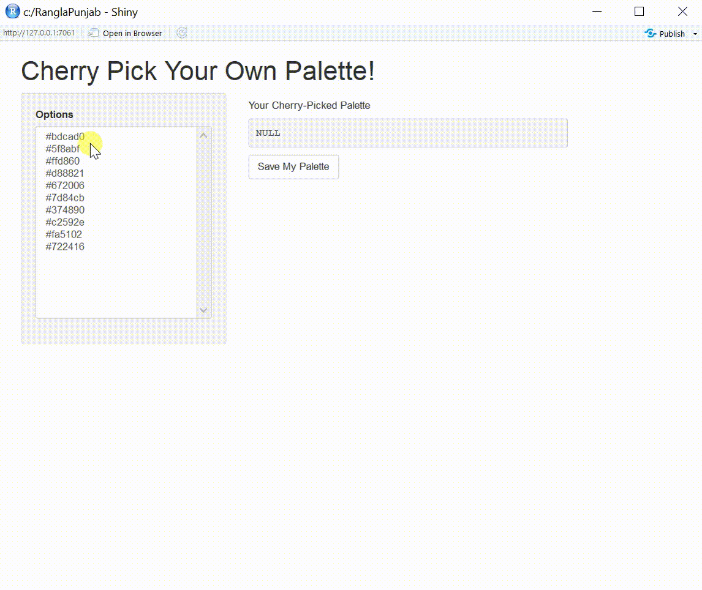
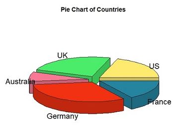
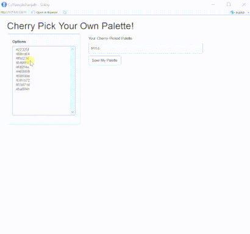

```{r setup, include = FALSE}
knitr::opts_chunk$set(
  collapse = TRUE,
  comment = "#>"
)
```

R code that defines color palettes based on the [unique, vibrant culture of Punjab, India](https://www.youtube.com/watch?v=wDheWYmNEhQ).

Rangla Punjab translates to "Colorful Punjab".

And if you ever visit India, [Rangla Punjab](https://haveli.co/rangla-punjab/) is a wonderful Punjabi theme village of generations gone by.

In the meantime, enjoy this R package :-)


## Functions

<li><a href="#ranglapunjab">Rangla Punjab: <code>RanglaPunjab(name)</code></a></li>
<li><a href="#listpalette">List Palette: <code>ListPalette()</code></a></li>
<li><a href="#mergepalette">Merge Palette: <code>MergePalette(name, name2, name3)</code></a></li>
<li><a href="#paintpalette">Paint Palette: <code>PaintPalette(name, name2, name3)</code></a></li>
<li><a href="#cherrypickpalette">Cherry Pick Palette: <code>CherryPickPalette(name, name2, name3)</code></a></li>
<li><a href="#showpalettephoto">Show Palette Photo: <code>ShowPalettePhoto(name)</code></a></li>

## Sample Code

<li><a href="#3dpiechart">3-D Pie Chart</a></li>
<li><a href="#animatedbarplot">Bar Plot</a></li>

<h2 id="ranglapunjab">
Rangla Punjab: <code>RanglaPunjab(name)</code>
</h2>

Input 1 palette, return vector of colors

```r
> RanglaPunjab("GoldenTemple")
[1] "#bdcad0" "#5f8abf" "#ffd860" "#d88821" "#672006"
```

<h2 id="listpalette">
List Palette: <code>ListPalette()</code>
</h2>

Lists all 24 palettes

```r
> ListPalette()
 [1] "FieldsOfPunjab"       "FieldsOfPunjab2"        "GoldenTemple"           "GoldenTemple2"         
 [5] "Pindh"                "Haveli"                 "Haveli2"                "AmritsariKulcha"       
 [9] "CholeBhature"         "BiryaniRice"            "AmritsariLassi"         "AmritsariPedeWaliLassi"
[13] "Kulfi"                "SohniMahiwal"           "HeerRanjha"             "Gidha"                 
[17] "Gidha2"               "Teej"                   "Phulkari"               "Phulkari2"             
[21] "Jutti"                "Jutti2"                 "Jutti3"                 "Paranda" 
```

<h2 id="mergepalette">
Merge Palette: <code>MergePalette(name, name2, name3)</code>
</h2>

Input 2 to 3 palettes to merge into new palette

```r
MergePalette("AmritsariKulcha", "Phulkari2")
[1] "#e3e4d9" "#ebdc9c" "#b3340e" "#67140a" "#2a231d" "#9c1a41" "#42a4e8" "#3a35da" "#ee523c" "#3e167c"
```

<h2 id="paintpalette">
Paint Palette: <code>PaintPalette(name, name2, name3)</code>
</h2>

Input 1 to 3 palettes to display their colors on screen

```r
> PaintPalette("FieldsOfPunjab","Jutti","Paranda")
```


<h2 id="cherrypickpalette">
Cherry Pick Palette: <code>CherryPickPalette(name, name2, name3)</code>
</h2>

Input 2 to 3 palettes to visually select colors to create new palette. Will open interactive shiny app and 
save list of colors to`cherrypickedpalette`.

```r
> CherryPickPalette("GoldenTemple","GoldenTemple2")
```



<h2 id="showpalettephoto">
Show Palette Photo: <code>ShowPalettePhoto(name)</code>
</h2>

Input 1 palette to display photo that inspired these colors

```r
> ShowPalettePhoto("Jutti3")
```


<h2 id="3dpiechart">
3-D Pie Chart
</h2>

Use `RanglaPunjab` to color pie charts.

```r
library(RanglaPunjab)
library(plotrix)

slices <- c(10, 12, 4, 16, 8) 
lbls <- c("US", "UK", "Australia", "Germany", "France")
pie3D(slices,labels=lbls, explode=0.1, col=RanglaPunjab("Gidha"), main="Pie Chart of Countries ")
```


<h2 id="animatedbarplot">
Bar Plot
</h2>

Use `CherryPickPalette` to dynamically color bar plots.

```r
library(RanglaPunjab)

counts <- table(mtcars$vs, mtcars$gear)
barplot(counts, main="Car Distribution by Gears and VS",
        xlab="Number of Gears", col=CherryPickPalette("Teej","Jutti"),
        legend = rownames(counts))
```
